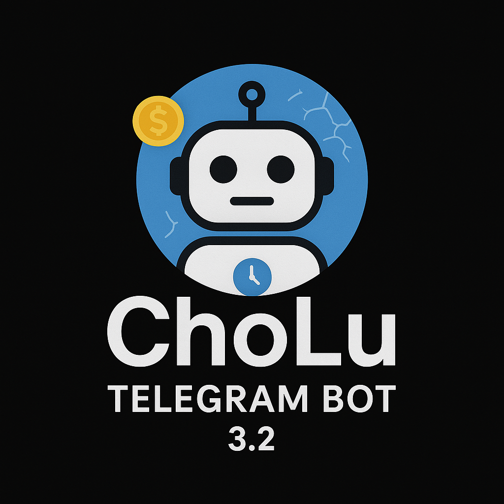
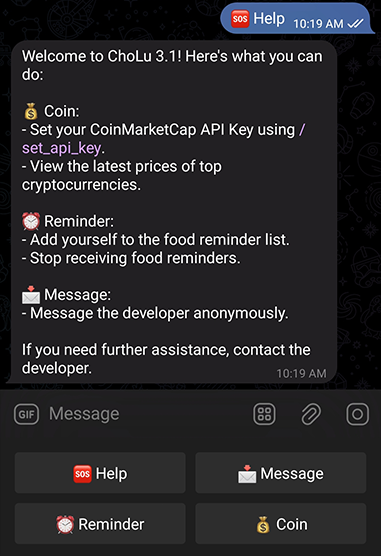

# ChoLu Telegram Bot - Comprehensive Documentation

## Table of Contents
- [Overview](#overview)
- [Key Improvements](#key-improvements)
- [Features](#features)
- [Installation](#installation)
  - [Docker Setup](#docker-setup-recommended)
  - [Manual Installation](#manual-installation)
- [Configuration](#configuration)
- [Database Structure](#database-structure)
- [Admin Commands](#admin-commands)
- [User Commands](#user-commands)
- [API Integration](#api-integration)
- [Reminder System](#reminder-system)
- [Technical Details](#technical-details)
- [License](#license)
- [Support](#support)
- [Contributing](#contributing)

## Overview

ChoLu is a versatile Telegram bot (version 3.2) designed with user experience in mind, featuring an intuitive interface built with aiogram for better inline keyboard support. The bot offers multiple functionalities including cryptocurrency price tracking, message forwarding, user management, and food reservation reminders. The bot now uses aiogram framework which provides better inline keyboard support and more responsive UI compared to the previous implementation.

  

## Key Improvements

- **User-Friendly Interface**: Migrated from legacy library to aiogram framework for better inline keyboard support and user-friendly interface
- **Enhanced Performance**: Multi-stage Docker build for optimized container size
- **Improved Reliability**: Better error handling and logging mechanisms
- **User Experience**: Redesigned menu system with intuitive navigation
- **Multifunctional**: Has two versions: button and command only

## Features

- **User Management**: Add/remove users, ban/unban functionality
- **Admin Tools**: Special commands for bot administrators
- **Cryptocurrency Tracking**: Real-time price data from CoinMarketCap API
- **Message System**: Anonymous messaging and broadcast capabilities
- **Reminder System**: Automated food reservation reminders
- **Database Export**: CSV export functionality for admins
- **Activity Logging**: Comprehensive logging of all user interactions

## Installation

### Prerequisites
- Python 3.8+
- Docker (optional)
- Telegram bot token from [BotFather](https://t.me/BotFather)

### Docker Setup (Recommended)

```bash
# Build and run standard version
docker build -t cholu-bot .
docker run -d --name cholu-bot --restart unless-stopped \
  -v ./data:/app/data \
  cholu-bot

# For CM version (using same image)
docker run -d --name cholu-bot-cm --restart unless-stopped \
  -v ./data:/app/data \
  -e BOT_MODE=CM \
  cholu-bot
```

## Manual Installation

1. Create and activate virtual environment:
   ```bash
   python -m venv venv
   source venv/bin/activate  # Linux/Mac
   venv\Scripts\activate  # Windows
   ```

2. Install dependencies:
   ```bash
   pip install -r requirements.txt
   ```

3. Configure the bot by creating `config.json` in root directory

4. Run the bot:
   ```bash
   python src/core/main.py        # Standard version
   python src/core/main-cmversion.py  # CM version
   ```

## Configuration

Create a `config.json` file in the root directory with the following structure:

```json
{
  "BOT_TOKEN": "YOUR_TELEGRAM_BOT_TOKEN",
  "OWNER_ID": "YOUR_TELEGRAM_USER_ID",
  "LOG_USER_ID": "TELEGRAM_USER_ID_FOR_LOGS",
  "TIMEZONE": "Asia/Tehran"
}
```

- `BOT_TOKEN`: Obtained from BotFather
- `OWNER_ID`: Your Telegram user ID (bot owner)
- `LOG_USER_ID`: User ID where logs will be sent
- `TIMEZONE`: Timezone for reminder system

## Database Structure

The bot uses a CSV-based database (`db.csv`) with the following columns:

| Column | Type | Description |
|--------|------|-------------|
| UserID | int | Telegram user ID |
| Ban | int (0/1) | Whether user is banned |
| Adminstration | int (0/1) | Admin status |
| API | str | CoinMarketCap API key |
| Reminder | int (0/1) | Food reminder subscription |
| Name | str | User display name |

## Admin Commands

### User Management
- `/admin_add [user_id]` - Add user as admin (owner only)
- `/admin_remove [user_id]` - Remove admin (owner only)
- `/user_ban [user_id]` - Ban a user
- `/user_unban [user_id]` - Unban a user
- `/user_manual_add [user_id]` - Manually add user to database

### Messaging
- `/send_message [user_id]` - Send message to specific user
- `/send_message all` - Broadcast message to all users

### Reminder System
- `/add_to_reminder [user_id]` - Add user to food reminder
- `/remove_from_reminder [user_id]` - Remove user from food reminder

### Database
- `/database` - Export database as CSV

## User Commands

*Main User Interface*  


### General
- `🆘 Help` - Show help information
- `🔙 Back to Main Menu` - Return to main menu

### Cryptocurrency
- `💰 Coin` - Show cryptocurrency menu
- `/set_api_key [api_key]` - Set CoinMarketCap API key
- `/how_to_set_api_key` - Instructions for getting API key

### Messaging
- `📩 Message` - Send anonymous message to developer

### Reminders
- `⏰ Reminder` - Manage food reminders
  - `➕ Add to Food Reminder` - Subscribe to reminders
  - `➖ Stop Food Reminder` - Unsubscribe from reminders

## API Integration

The bot integrates with the CoinMarketCap API to provide cryptocurrency prices. Users need to:

1. Get a free API key from [CoinMarketCap](https://pro.coinmarketcap.com/signup)
2. Set it using `/set_api_key YOUR_API_KEY`

Supported cryptocurrencies:
- BTC (₿), ETH (Ξ), USDT (💵), XRP (✕)
- BNB (ⓑ), SOL (◎), USDC (💲), DOGE (🐶)
- ADA (🅰), TRX (🅿), LINK (🔗), TON (⚡)

## Reminder System

The bot automatically sends food reservation reminders:
- Every Wednesday between 22:00-23:00 (configurable timezone)
- Users can subscribe/unsubscribe via menu
- Admins can manage subscriptions for all users

## Technical Details

- **Framework**: aiogram (replacing legacy library for better UI/UX)
- **Database**: CSV-based with automatic persistence
- **API Integration**: CoinMarketCap Pro API
- **Timezone Support**: Configurable (default: Asia/Tehran)
- **Error Handling**: Comprehensive logging and error recovery

## License

This project is licensed under the MIT License. See the [LICENSE](LICENSE) file for details.

## Support

If you have any questions or need assistance, feel free to reach out on [Telegram](https://t.me/masihssj).

## Contributing

Contributions are welcome! Please follow these steps:
1. Fork the repository
2. Create a feature branch
3. Commit your changes
4. Push to the branch
5. Create a Pull Request

For major changes, please open an issue first to discuss the proposed changes.

---

**Note**: This bot requires Python 3.8+ and the dependencies listed in `requirements.txt`. Ensure you have proper permissions before running admin commands.